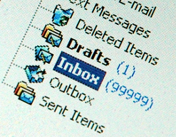

If it's about a project in one of my GitHub repositories then use
whatever means are currently available i.e. the issue system and I
will receive it in due course.

However, should you want to send me an email then the following
address has been known to work ;)
	
    b2JqaXRzdUBnbWFpbC5jb20NCg==

For those in the know, you know what to do about it, if you are not
sure, [this page might help.](https://www.base64decode.org/)

Thanks for dropping by.
